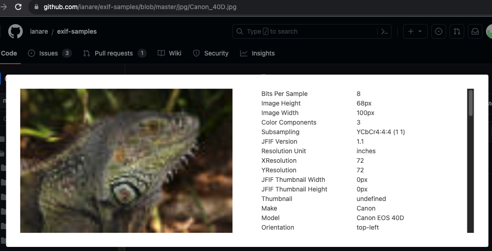

# プロジェクト

この拡張機能は、外部サイトに画像を送信せずにEXIF情報の解析することを目指して作成しています。

## 概要

この拡張機能は、Google ChromeでWebページ内の画像を外部に送信せずにEXIF情報を表示するための機能を提供します。  
(外部送信しないので)インターネット接続なしで利用可能ですが、ローカルファイルは解析できません。

## インストール方法

### ストア版

以下のURLからブラウザの拡張機能として追加してください。

* (申請中)

### 未パッケージ版

以下の手順に従って、ストアを経由せずにこの拡張機能をインストールすることができます。

1. このリポジトリをクローンするか、ZIPファイルとしてダウンロードします。
2. Google Chromeの[拡張機能]ページを開きます（chrome://extensions/）。
3. 右上の[デベロッパーモード]スイッチをオンにします。
4. [パッケージ化されていない拡張機能を読み込む]ボタンをクリックし、先ほどダウンロードしたフォルダを選択します。
    * `path/to/exif-viewer-extension/`

## 使い方

このセクションでは、拡張機能の使用方法に関する詳細なガイドを提供します。必要に応じてコード例やスクリーンショットを使用して、利用者がスムーズに始められるようにサポートしましょう。

### 解析/表示方法1

画像を右クリックして拡張機能を呼び出すと、右クリックした画像の解析結果がモーダルウィンドウで表示されます。
モーダルウィンドウのウィンドウ外をクリックすると消えます。

### 解析/表示方法2

拡張機能のポップアップから「🔍」をクリックすると、webページ内の画像リストがサイズ順に表示されるので、
ファイル名やサイズをクリックすると解析結果がモーダルウィンドウで表示されます。
モーダルウィンドウのウィンドウ外をクリックすると消えます。

## 対応環境

Manifest V3に対応したバージョン以降のChromiumベースのブラウザであれば実行可能だと思います。

## 貢献

このプロジェクトに興味を持っていただき、ありがとうございます！プルリクエストやイシューを歓迎します。
以下は、貢献する際の一般的なガイドラインです。

1. このリポジトリをフォークします。
2. ブランチを作成して、新しい機能やバグ修正を実装します。
3. コードに適切なテストを追加します。
4. プルリクエストを作成します。

## ライセンス

このプロジェクトは MPL2.0 のもとでライセンスされています。詳細は[LICENSE.md](LICENSE.md)を参照してください。

## 作者

この拡張機能は [@akai_kichune](https://twitter.com/akai_kichune) によって作成されました。

# CREDIT

* ExifReader-src/
    * [ExifReader](https://github.com/mattiasw/ExifReader)/src
* screenshot
    * [exif-samples](https://github.com/ianare/exif-samples)

